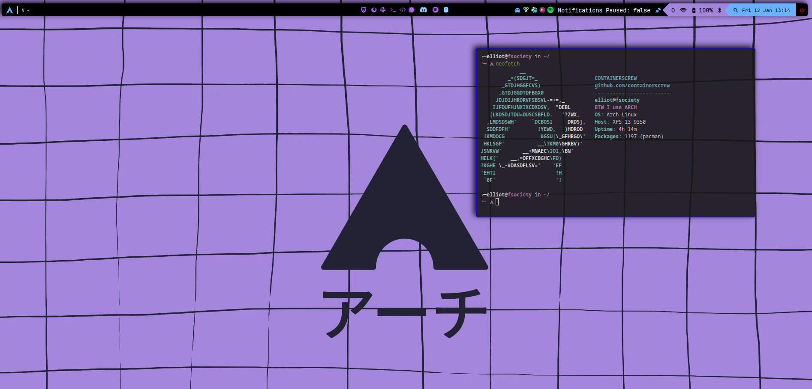

# Containerscrew DOTFILES

My dotfiles in Arch Linux.



# Disclaimer ⚠️

It is my personal setup, the way I like it, with configurations that are comfortable for me, applications... etc. Use it if you want as a template, as a guide. I will update it as I need to add new packages, configs...etc. Don't use [installer.sh](./installer.sh) every time as it can break your current setup.

And yes... all my commits in this repo you will see that they are called **Wip** 😀

# Arch Linux installation

The installation of Arch Linux has been carried out using [archinstall](https://wiki.archlinux.org/title/archinstall). 
The [official installation page](https://wiki.archlinux.org/title/Installation_guide) is also very complete, everything and that using archinstall is more comfortable and makes the process easier.

## Before installation using archinstall 

Pre-flight checks 🚀

## Connect to the internet

Once the usb is booted, connect the laptop to your local network (if not using ethernet cable).

```shell
iwctl station wlan0 get-networks # change wlan0 interface if needed. Type `$ ip a` if you don't know the name 
iwctl stations wlan0 connect SSID # put the SSID/BSSID with your corresponding local network
ping -c 1 1.1.1.1 # test connectivity
archinstall # start installation 
```

## Considerations


# Credits

* https://github.com/rxyhn/tokyo/tree/main
* https://github.com/gh0stzk/dotfiles/tree/master
* https://github.com/NoiSek/Aether
* https://github.com/adi1090x/polybar-themes
* https://github.com/ART3MISTICAL/dotfiles/tree/main
* [The Bible](https://wiki.archlinux.org/)
* [Polybar Setup](https://www.youtube.com/watch?v=tOBDUBEMAKM)
* https://github.com/antoniosarosi/dotfiles
* https://gitlab.com/dwt1/dotfiles

# iwd 
https://wiki.archlinux.org/title/Iwd

iwctl station wlan0 get-networks
iwctl stations wlan0 connect SSID
pacman -S openssh neovim
archinstall
nmcli device wifi connect SSID_or_BSSID password password


# First steps after installation

* nmcli device wifi connect SSID_or_BSSID password password
* sudo pacman -S rsync 
* rsync -avzh --exclude='.git/' dotfiles/ elliot@192.168.0.30:/home/elliot


#  TO DO 

* Bluetooth
* loadkeys en
* mouse natural scrolling
* Install GTK theme
* grub theme
* starship prompt
* install a clipboard
* config.fish full aliases and setup
* permanent wg-quick setup
* automatic setup omf plugins (git, kubectl...etc)
* some widgets using eww 
* tmux config
* neovim configuration and plugins

tcpdump wireguard connection: https://www.procustodibus.com/blog/2021/03/wireguard-logs/

# Connect protonvpn

```shell
protonvpn-cli connect --fastest --protocol udp
```

# X11 change keyboard 

sudo nvim /etc/X11/xorg.conf.d/00-keyboard.conf 

localectl set-x11-keymap us default intl 

# Timezone

timedatectl set-timezone Europe/Amsterdam
timedatectl list-timezones | grep -I "Europe"

# Setup my custom vpn (PROTONVPN) using wireguard protocol

https://protonvpn.com/support/wireguard-manual-linux/

download wireguad config

sudo mv X.conf to /etc/wireguard/protonvpn.conf
sudo systemctl enable wg-quick@protonvpn.service --now 
curl ifconfig.me

# CHange mac address of your interface permanently

Pending to rename iface

https://wiki.archlinux.org/title/Network_configuration

`/etc/systemd/network/10-net0.link`

```
[Match]
PermanentMACAddress=2e:62:28:d5:a7:fb
Name=wlp58s0


[Link]
Name=wlan0
PermanentMACAddress=82:8d:c4:ce:94:ba
```
* remember to change te iface name if needed

By the moment this task was done using macchanger with a custom systemd service


# Change /etc/systemd/resolved.conf 

Put:

[Resolve]
# Some examples of DNS servers which may be used for DNS= and FallbackDNS=:
# Cloudflare: 1.1.1.1#cloudflare-dns.com 1.0.0.1#cloudflare-dns.com 2606:4700:4700::1111#cloudflare-dns.com 2606:4700:4700::1001#cloudflare-dns.com
# Google:     8.8.8.8#dns.google 8.8.4.4#dns.google 2001:4860:4860::8888#dns.google 2001:4860:4860::8844#dns.google
# Quad9:      9.9.9.9#dns.quad9.net 149.112.112.112#dns.quad9.net 2620:fe::fe#dns.quad9.net 2620:fe::9#dns.quad9.net
DNS=1.1.1.1
FallbackDNS=1.1.1.1#cloudflare-dns.com 9.9.9.9#dns.quad9.net 8.8.8.8#dns.google 2606:4700:4700::1111#cloudflare-dns.com 2620:fe::9#dns.quad9.net 2001:4860:4860::8888#dns.google
#Domains=
DNSSEC=no

sudo systemctl restart systemd-resolved
# ln -sf ../run/systemd/resolve/stub-resolv.conf /etc/resolv.conf

# GTK THEME
material black blueberry: https://www.pling.com/p/1316887/


# Setup EBPF tools
https://aya-rs.dev/book/start/development/#ebpf-program-constraints


# Setup touchpad
https://wiki.archlinux.org/title/Libinput