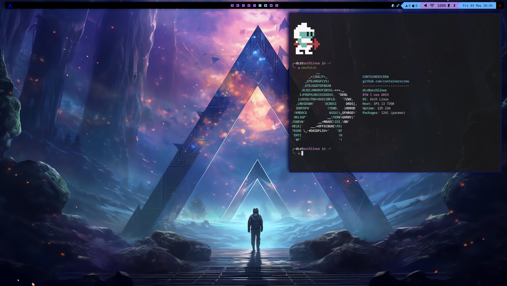
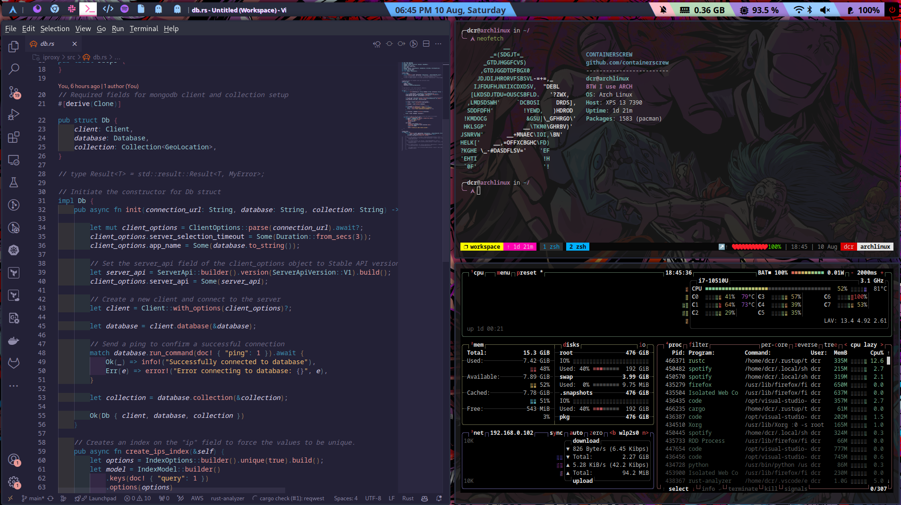

<!-- START OF TOC !DO NOT EDIT THIS CONTENT MANUALLY-->
**Table of Contents**  *generated with [mtoc](https://github.com/containerscrew/mtoc)*
- [containerscrew dotfiles](#containerscrew-dotfiles)
- [Disclaimer ⚠️](#disclaimer-⚠️)
- [Arch Linux installation](#arch-linux-installation)
  - [Before installation using archinstall](#before-installation-using-archinstall)
    - [Connect to the internet](#connect-to-the-internet)
    - [Start the installation](#start-the-installation)
    - [Considerations in archinstall](#considerations-in-archinstall)
  - [After installation](#after-installation)
    - [Connect the computer to the internet](#connect-the-computer-to-the-internet)
    - [Download dotfiles](#download-dotfiles)
    - [Option 1: Download dotfiles from git](#option-1:-download-dotfiles-from-git)
    - [Option 2: Copy dotfiles from another computer](#option-2:-copy-dotfiles-from-another-computer)
- [Run setup.sh](#run-setup.sh)
- [dotfiles installation](#dotfiles-installation)
  - [Packages](#packages)
  - [Core config](#core-config)
- [User config](#user-config)
- [Run all](#run-all)
- [Post install](#post-install)
- [Shortcuts](#shortcuts)
- [Tips](#tips)
- [Links & Credits](#links-&-credits)
- [License](#license)
<!-- END OF TOC -->
# containerscrew dotfiles

My dotfiles using Arch Linux. Just for the time it takes to document this repository and configurations, **this repo deserves one star!**


> [!WARNING]
> The documentation is not yet well finished. There are still things to document and configure. However, I hope the configuration files can help you.





# Disclaimer ⚠️

It is my personal setup, the way I like it, with configurations, applications that are comfortable for me. Use it if you want as a template, as a guide. I will update it as I need to add new packages, configs...etc.

> [!IMPORTANT]
> There are still many things to configure, I will do it as I go. Mouse, trackpad, eww widgets... etc

And yes... all my commits in this repo you will see that they are called **Wip** 😀

# Arch Linux installation

The installation of Arch Linux has been carried out using [archinstall](https://wiki.archlinux.org/title/archinstall).
The [official installation page](https://wiki.archlinux.org/title/Installation_guide) is also very complete, everything and that using archinstall is more comfortable and makes the process easier.

1. Download `ISO` file. https://archlinux.org/download/ (to download the torrent I use [`transmission`](https://transmissionbt.com/))
2. Take a pendrive and burn the ISO using, for example, https://etcher.balena.io/
3. Insert the pendrive into the new PC, modify the boot options to use the pendrive instead of the local disk.
4. If all goes well, you should see the distro prompt.

```bash
root@archiso ~ #
```

## Before installation using archinstall

Pre-flight checks 🚀

### Connect to the internet

Once the usb is booted, connect the laptop to your local network (if not using ethernet cable).

```bash
iwctl station wlan0 get-networks # change wlan0 interface if needed. Type `$ ip a` if you don't know the name
iwctl station wlan0 connect SSID # put the SSID/BSSID with your corresponding local network
ping -c 1 1.1.1.1 # test connectivity
```

> [iwd](https://wiki.archlinux.org/title/Iwd) official documentation

### Start the installation

Run the following command:

```bash
$ archinstall
```

### Considerations in archinstall

Example of my configurations. Modify those you consider necessary.

| Setting                   | Configuration                       |
|---------------------------|-------------------------------------|
| Archinstall language      | English (100%)                      |
| Mirrors                   | Netherlands                         |
| Keyboard/Language/Encoding| en/en_US/UTF-8                      |
| Disk Configuration        | Use best effort/BTRFS/Default partitioning|
| Disk Encryption           | **ALWAYS**                          |
| Bootloader                | Grub                                |
| Swap                      | True                                |
| Hostname                  | archlinux                           |
| Profile                   | Minimal                             |
| Root password             | Yes                                 |
| User sudoer               | Yes                                 |
| Audio                     | Pipewire                            |
| Kernels                   | Linux                               |
| Additional packages       | rsync python3 openssh neovim curl git wget |
| Network                   | NetworkManager                      |
| UTC                       | Europe/Amsterdam                    |
| Optional repos            | multilib                            |

> The installer will ask if you want to chroot into the system. Type yes and enable ssh (for rsync). `systemctl enable sshd`. Will be necessary if you want to rsync files from other computer. If not necesary, do not enable this service.

> Remember to disable sshd later. In fact, ufw will block all external connections.

## After installation

First setps after installation. Remove the usb from your computer and restart. Grub will launch the new archlinux distro, and a basic prompt (black window) will appear. Enter your username and password.


### Connect the computer to the internet

```bash
$ sudo su -
$ nmcli device wifi list
$ nmcli device wifi connect SSID_or_BSSID password SSID/BSSID-PASSWORD
# or use
$ nmcli device wifi connect -a
$ ping -c 1 1.1.1.1 # check connectivity
$ history -c
$ exit
```

### Download dotfiles

### Option 1: Download dotfiles from git

```shell
$ cd /tmp
$ git clone https://github.com/containerscrew/dotfiles.git
```

### Option 2: Copy dotfiles from another computer

In the origin computer:

```shell
make remote-sync IP=192.168.X.X USER=bob
```

Replace the ip and the user. Both values are those of the target computer, where you are installing these settings. To know the ip run on the target pc:

```bash
$ ip a
```

> This should work, as you should have enabled openssh in the archinstall step. If not, on the target machine, run `sudo systemctl enable sshd --now`

<!-- ### Only copy ~/.config files

```shell
cd dotfiles/
rsync -avzhu config/* username@192.168.X.X:/home/username/.config/
# Or locally
rsync -avzhu config/* /home/username/.config/
``` -->

# Run setup.sh

[setup.sh](./setup.sh) will install main packages using `pacman` and `paru`. Also, will copy all config files in user home, will set some basic configs like `firewall`, `lightdm` theme...etc. Take a look!

> All installation scripts are in the `installers` folder


# dotfiles installation

Now, is time to install all the necessary `dotfiles/packages/configurations`. I have decided to separate each part into a `.sh` file inside the `installers/` folder. There is also [a file](./installers//run_all.sh) that executes in order all at once. **I recommend to go step by step to understand what is going on.**

> [!WARNING]
> All the scripts must be executed inside the `repo root` folder.

**Remember, these packages many are necessary for the whole Qtile setup and others are custom that I use. Modify it to your needs**

## Packages

The distro comes with the defaults. Is time to install our custom packages. Please take a look to [installers/packages.sh](./installers/packages.sh).

Inside the folder `dotfiles`, where you cloned the repo, run:

```bash
$ ./installers/packages.sh
```

## Core config

Configurations about `networking`, `display managers` and more.

Run:

```bash
$ ./installers/core_config.sh
```

# User config

Configurations about `~/.config/`, `user permissions`, `mouse`, `shell` and more. Here is probably where you will need to change and adapt the configuration to your personal tools, configs... as you like.


Run:

```bash
$ ./installers/user_config.sh
```

# Run all

All in one:

```bash
./installers/run_all.sh
```

# Post install

Post intallation setps. Some work settings, and other stuff.

See [postinstall.md](./docs/postinstall.md)


# Shortcuts

See [shortcuts](./docs/shortcuts.md) documentation.

# Tips

Some tips about archlinux configurations.

[Tips](./docs/tips.md) documentation


# Links & Credits

[Useful links & credits](./docs/links.md)

# License

[LICENSE](./LICENSE)
