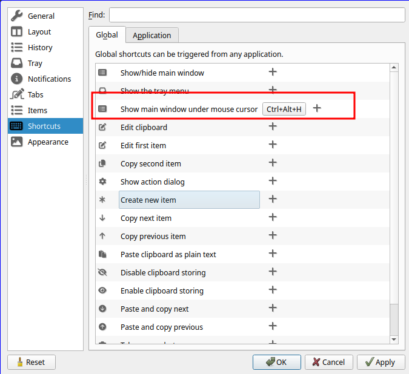

<!-- START doctoc generated TOC please keep comment here to allow auto update -->
<!-- DON'T EDIT THIS SECTION, INSTEAD RE-RUN doctoc TO UPDATE -->
**Table of Contents**  *generated with [DocToc](https://github.com/thlorenz/doctoc)*

- [QTILE main shortcuts](#qtile-main-shortcuts)
- [CopyQ clipboard manager](#copyq-clipboard-manager)

<!-- END doctoc generated TOC please keep comment here to allow auto update -->

# QTILE main shortcuts

> The mod key is the "typical windows key"

| Key                | Action                           |
|--------------------|----------------------------------|
| mod + return       | Open alacritty terminal          |
| mod + alt + return | Open floatting terminal          |
| mod + alt + f      | Open firefox                     |
| mod + alt + g      | Open google chrome               |
| mod + alt + b      | Open brave                       |
| mod + alt + s      | Take screenshot using flameshot  |
| mod + tab          | Previous window                  |
| mod + alt + p      | Change wallpapers                |
| mod + alt + r      | Reload Qtile configuration       |
| cntrol + mod + r   | Restart Qtile                    |
| cntrol + alt + l   | Lock screen using lightdm        |
| cntrol + t         | Make the actual window floating |

You can find more shortcuts or customize new ones [here](../config/qtile/configurations/keys.py)

# CopyQ clipboard manager

CopyQ is launched when Qtile starts. Btw, you need to add manually the shortcut to open all the entries.

Open CopyQ and go to File > Preferences > Shortcuts

